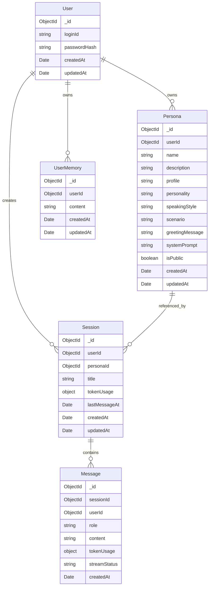

# 01 Data Model

> Mongoose 스키마와 인덱스 정의 + Redis 키 구조. 결정 근거는 `02_ADRs.md`로 분리.

## 엔티티 개요



## 식별자 정책

별도 public id를 두지 않고 MongoDB 기본 `_id`를 API 식별자로 사용한다.

- HTTP 요청/응답의 `id`, `personaId`, `sessionId`는 ObjectId 문자열
- 컨트롤러에서 `toObjectId()`로 검증 후 서비스 계층에는 `Types.ObjectId` 전달
- Mongoose `ref`와 `populate`는 기본 `_id` 관계를 그대로 사용

## MongoDB 스키마 정의 (Mongoose)

### User

```typescript
@Schema({ timestamps: true })
export class User {
  @Prop({ required: true, unique: true, index: true })
  loginId: string;

  @Prop({ required: true })
  passwordHash: string;
}
```

**인덱스**

- `{ loginId: 1 }` unique. 로그인 조회

---

### UserMemory

```typescript
@Schema({ timestamps: true })
export class UserMemory {
  @Prop({ type: Types.ObjectId, ref: "User", required: true })
  userId: Types.ObjectId;

  @Prop({ required: true, maxlength: 1000 })
  content: string;
}
```

Phase 1은 사용자가 직접 등록한 확정 메모리만 저장한다. 자동 추출, pending 상태, confidence, source 분리는 Phase 2 범위다.

LLM 호출 시 최근 사용자 메모리 최대 20개를 system prompt 뒤에 `Known about the user` 섹션으로 주입한다. 메모리는 관련 있을 때만 자연스럽게 사용하고, 모델이 저장된 메모리를 사용 중이라고 직접 언급하지 않도록 지시한다.

**인덱스**

- `{ userId: 1, createdAt: -1 }`. 사용자별 메모리 목록 및 프롬프트 주입 조회

---

### Persona

```typescript
@Schema({ timestamps: true })
export class Persona {
  @Prop({ type: Types.ObjectId, ref: "User", required: true })
  userId: Types.ObjectId;

  @Prop({ required: true, maxlength: 50 })
  name: string;

  @Prop({ maxlength: 200 })
  description: string;

  @Prop({ required: true, maxlength: 1000 })
  profile: string;

  @Prop({ required: true, maxlength: 1000 })
  personality: string;

  @Prop({ required: true, maxlength: 1000 })
  speakingStyle: string;

  @Prop({ required: true, maxlength: 1000 })
  scenario: string;

  @Prop({ required: true, maxlength: 500 })
  greetingMessage: string;

  @Prop({ required: true, maxlength: 6000 })
  systemPrompt: string;

  @Prop({ required: true, default: false })
  isPublic: boolean;
}
```

`systemPrompt`는 클라이언트가 직접 입력하지 않는다. 서버가 base prompt harness와 `profile/personality/speakingStyle/scenario`를 조합해 생성한다.

페르소나는 비공개 상태에서만 수정 가능하다. 공개 후에는 캐릭터 정체성과 공개 상태를 잠그며, 공개 페르소나는 다시 비공개로 전환할 수 없다. 이 정책은 Mongoose의 `immutable`이 아니라 서비스 계층에서 검증한다.

**인덱스**

- `{ isPublic: 1, createdAt: -1 }`. 공개 페르소나 최신순 목록
- `{ userId: 1, createdAt: -1 }`. 사용자별 페르소나 목록 조회
- `{ isPublic: 1, name: 1, createdAt: -1 }`. 공개 페르소나 이름 검색

---

### Session

```typescript
@Schema({ _id: false })
export class SessionTokenUsage {
  @Prop({ default: 0 })
  prompt: number;

  @Prop({ default: 0 })
  completion: number;

  @Prop({ default: 0 })
  total: number;
}

@Schema({ timestamps: true })
export class Session {
  @Prop({ type: Types.ObjectId, ref: "User", required: true })
  userId: Types.ObjectId;

  @Prop({ type: Types.ObjectId, ref: "Persona", required: true })
  personaId: Types.ObjectId;

  @Prop({ default: null })
  title: string | null;

  @Prop({ type: Date, default: null })
  lastMessageAt: Date | null;

  @Prop({
    type: SessionTokenUsageSchema,
    default: () => ({ prompt: 0, completion: 0, total: 0 }),
  })
  tokenUsage: SessionTokenUsage;

  @Prop({ type: String, default: null, maxlength: 4000 })
  stateSummary: string | null;

  @Prop({ type: Types.ObjectId, ref: "Message", default: null })
  summaryCursorMessageId: Types.ObjectId | null;

  @Prop({ type: Date, default: null })
  summaryUpdatedAt: Date | null;
}
```

**인덱스**

- `{ userId: 1, lastMessageAt: -1 }`. 사용자별 최근 세션 목록 조회

---

### Message

```typescript
@Schema({ _id: false })
export class MessageTokenUsage {
  @Prop({ default: 0 })
  prompt: number;

  @Prop({ default: 0 })
  completion: number;

  @Prop({ default: 0 })
  total: number;
}

@Schema({ timestamps: true })
export class Message {
  @Prop({ type: Types.ObjectId, ref: "Session", required: true })
  sessionId: Types.ObjectId;

  @Prop({ type: Types.ObjectId, ref: "User", required: true })
  userId: Types.ObjectId;

  @Prop({ required: true, enum: ["user", "assistant"] })
  role: "user" | "assistant";

  @Prop({ default: "" })
  content: string;

  @Prop({ type: MessageTokenUsageSchema, default: null })
  tokenUsage: MessageTokenUsage | null;

  @Prop({
    enum: ["pending", "streaming", "completed", "failed"],
    default: "completed",
  })
  streamStatus: "pending" | "streaming" | "completed" | "failed";
}
```

**인덱스**

- `{ sessionId: 1, createdAt: -1 }`. 컨텍스트 윈도우 fallback 조회 (ADR-3, ADR-7)
- `{ userId: 1, createdAt: -1 }`. 사용자별 토큰 통계 (Stats API)

---

## Redis 키 구조 (ADR-7, ADR-8)

Mongo가 source of truth, Redis는 derived cache + 동시성 제어 도구. Redis 단독 데이터는 없음. 장애 시 항상 Mongo로 fallback 가능해야 함.

### 컨텍스트 윈도우 캐시 (ADR-7)

```
Key:   ctx:{sessionId}
Type:  List
Value: JSON-encoded message snippets
       [
         { "id": "...", "role": "user", "content": "..." },
         { "id": "...", "role": "assistant", "content": "..." },
         ...
       ]
       (LPUSH로 최신이 head, LTRIM 0~N-1로 N개 유지)
TTL:   60분 (대화 휴면 시 자연 제거 + stale context 위험 축소)
크기:  N=8, 메시지당 평균 500 bytes → 세션당 약 4KB
```

**연산:**

- 메시지 추가 (user / assistant 완료 시): `LPUSH ctx:{sessionId} <json>` + `LTRIM ctx:{sessionId} 0 7` + `EXPIRE ctx:{sessionId} 3600`
- 컨텍스트 조회 (LLM 호출 직전): `LRANGE ctx:{sessionId} 0 -1` → reverse → LLM에 ascending 순서로 전달
- Cache miss: Mongo `{sessionId, createdAt desc}` 인덱스로 조회 후 Redis에 채움. 캐시 쓰기 실패는 무시.
- Redis read 장애: Mongo fallback만 수행하고 Redis 재적재는 시도하지 않음
- Stale cache limitation: Redis hit은 신뢰한다. Redis 장애 중 누락된 메시지가 있어도 TTL 만료 또는 이후 write 전까지 오래된 context가 사용될 수 있다.

### 세션 분산 락 (ADR-8)

```
Key:   lock:session:{sessionId}
Type:  String
Value: <ownerId> (uuid v4, 락 소유권 검증용)
TTL:   60초 (LLM 응답 평균 5~30초 고려한 여유)
```

**연산:**

- 획득: `SET lock:session:{sessionId} <ownerId> NX EX 60` → OK이면 획득, NIL이면 실패 (다른 요청 처리 중)
- 해제 (안전한 해제, Lua script):
  ```lua
  if redis.call("get", KEYS[1]) == ARGV[1] then
    return redis.call("del", KEYS[1])
  else
    return 0
  end
  ```
- 락 만료 위험: 스트리밍 응답이 60초를 넘으면 락 만료 가능. 대응:
  - 1차 단순화: TTL 60초로 시작
  - 2차 (필요 시): Watchdog 패턴. 락 획득 후 20초마다 TTL 갱신 (`EXPIRE`)

## Session 메타데이터 정책

`Session`의 다음 필드는 세션 목록 조회와 비용 요약을 위한 메타데이터.

| 필드            | 출처                                       | 갱신 시점                    |
| --------------- | ------------------------------------------ | ---------------------------- |
| `title`         | 첫 사용자 메시지 또는 사용자가 지정한 제목 | 세션 생성/제목 변경 시       |
| `lastMessageAt` | `max(messages.createdAt where sessionId)`  | 메시지 추가 시               |
| `tokenUsage`    | `sum(messages.tokenUsage)`                 | assistant 응답 완료 시       |
| `stateSummary`  | 현재 장소·상황·관계·중요 사건 요약         | `summaryTriggerInterval`마다 |

`title`, `lastMessageAt`은 빈값 가능. `tokenUsage`는 `$inc` 누적 업데이트를 위해 0 객체로 시작.

- `title`: `null`
- `lastMessageAt`: `null`
- `tokenUsage`: `{ prompt: 0, completion: 0, total: 0 }`
- `stateSummary`: `null`
- `summaryCursorMessageId`: `null`

정확한 통계가 필요한 API에서는 항상 `messages` aggregation으로 재계산 가능.

`summaryCursorMessageId`는 마지막으로 `stateSummary`에 반영한 메시지 id다. 컨텍스트 윈도우 8개 기준, `8 - 2 = 6`개 completed 메시지가 커서 이후 쌓이면 요약 LLM을 호출해 `stateSummary`를 갱신한다. 이 값은 `CHAT_SUMMARY_TRIGGER_INTERVAL` 상수에서 계산한다. 첫 요약은 `CHAT_SUMMARY_INITIAL_MESSAGE_LIMIT`개 메시지, 이후 요약은 기존 summary와 최신 `CHAT_SUMMARY_MESSAGE_LIMIT`개 completed 메시지를 사용한다.

## 컬렉션 크기 가정

본 설계가 가정하는 규모는 다음과 같다.

- 사용자 1만명, 사용자당 페르소나 평균 3개 → personas 약 3만 doc
- 사용자당 세션 평균 10개 → sessions 약 10만 doc
- 세션당 메시지 평균 50턴 (user + assistant) → messages 약 500만 doc
- 이 규모에서 단일 노드 Mongo + 단일 Redis 인스턴스로 충분. 샤딩 필요 시 `userId` 기반 hashed shard key 권장 (README "개선 여지"에 명시)

## 다음 문서

- [02_ADRs.md](02_ADRs.md). 위 결정들의 근거 풀버전
- [03_API_Spec.md](03_API_Spec.md). 엔드포인트별 어떤 쿼리·인덱스 사용하는지
